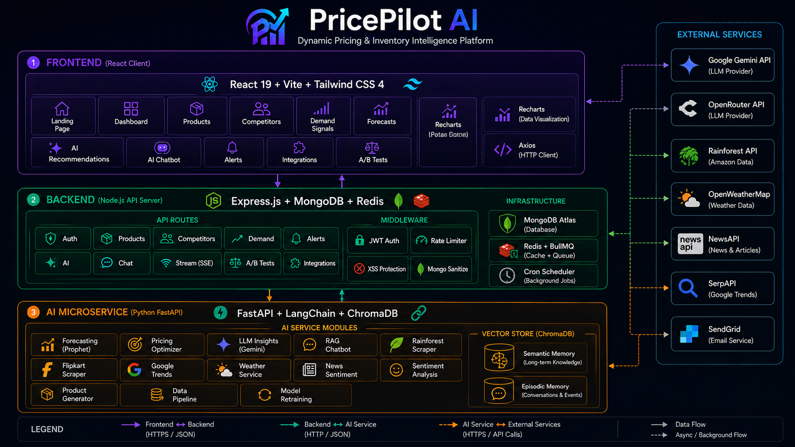
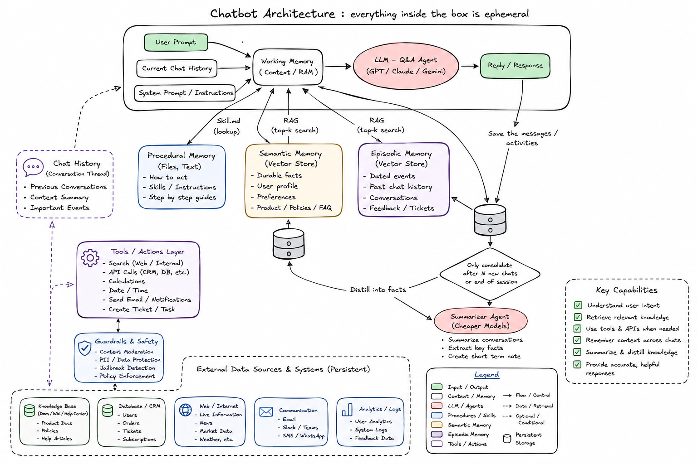
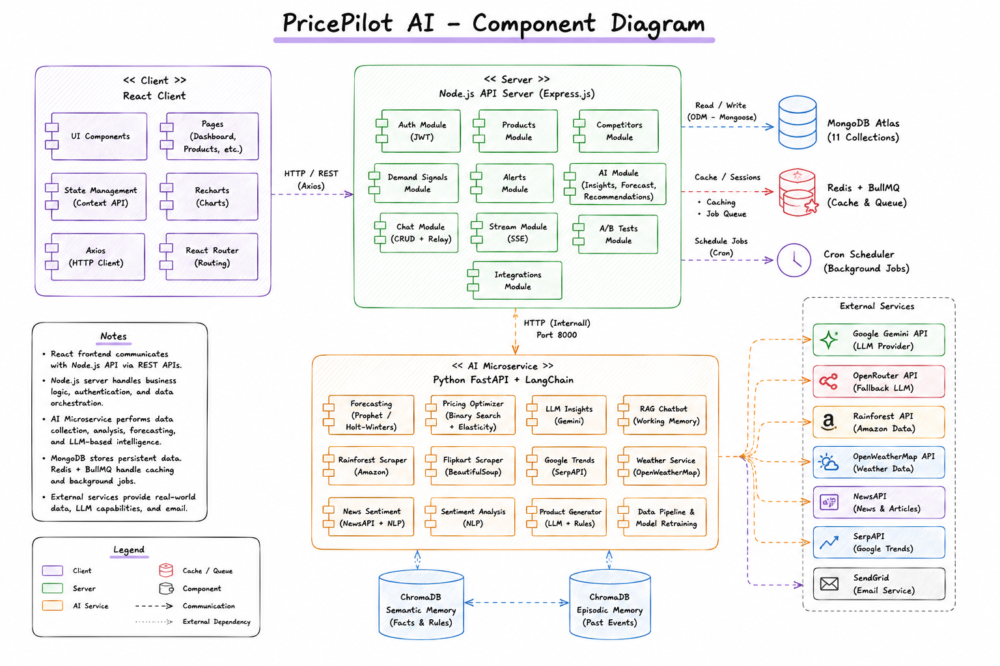
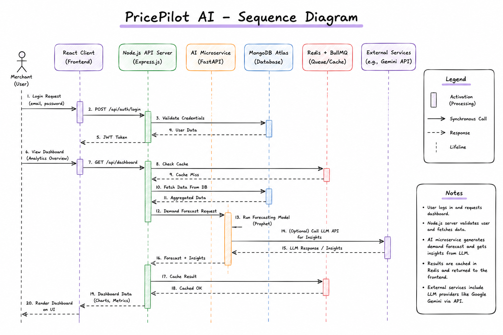

<p align="center">
  
</p>

<h1 align="center">🚀 PricePilot AI — Dynamic Pricing & Inventory Intelligence Platform</h1>

<p align="center">
  <strong>An AI-powered e-commerce pricing optimization platform that leverages machine learning, competitor analysis, demand forecasting, and conversational AI to deliver real-time pricing recommendations.</strong>
</p>

<p align="center">
  
  
  
  
  
  
  
  
</p>

---

## 📋 Project Information

| Field | Details |
|-------|---------|
| **Course Name** | Project |
| **Course Code** | PRO230812 |
| **Department** | CSE (Computer Science and Engineering) |
| **Semester** | V |
| **Topic** | PricePilot AI – Dynamic Pricing and Inventory Intelligence Platform |
| **Academic Year** | 2025–2026 |
| **Institution** | Final Year Project |

### 👥 Team Members

| Name | Roll No. |
|------|----------|
| **Rudra Babar** | B002 |
| **Aryan Desale** | B010 |

---

## 📖 Table of Contents

- [About the Project](#-about-the-project)
- [Key Features](#-key-features)
- [System Architecture](#-system-architecture)
- [Tech Stack](#-tech-stack)
- [Project Structure](#-project-structure)
- [Getting Started](#-getting-started)
- [Environment Variables](#-environment-variables)
- [API Endpoints](#-api-endpoints)
- [Deployment](#-deployment)
- [Screenshots](#-screenshots)
- [Architecture Diagrams](#-architecture-diagrams)
- [Research Papers & Inspiration](#-research-papers--inspiration)
- [License](#-license)

---

## 🎯 About the Project

**PricePilot AI** is a full-stack AI-powered platform designed for e-commerce businesses to optimize their pricing strategies in real time. The platform integrates multiple data signals — competitor pricing, demand fluctuations, inventory levels, weather patterns, social sentiment, news analysis, and search trends — to generate intelligent pricing recommendations that maximize revenue and maintain competitive positioning.

Traditional pricing strategies rely on static rules and manual adjustments, which fail to adapt to rapidly changing market dynamics. PricePilot AI addresses this gap by applying **machine learning**, **time-series forecasting (Prophet/Holt-Winters)**, **Retrieval-Augmented Generation (RAG)**, and **large language models (Google Gemini)** to deliver data-driven, explainable pricing decisions.

### Problem Statement

E-commerce businesses face several pricing challenges:
- **Manual pricing** cannot scale across thousands of SKUs
- **Competitor prices** change frequently and unpredictably
- **Demand patterns** are influenced by seasonality, events, weather, and social trends
- **Inventory management** requires proactive stock-out prevention
- **Revenue optimization** needs balancing margin targets with market competitiveness
- **Decision opacity** — merchants don't understand _why_ a price was suggested

PricePilot AI solves these challenges with automated, intelligent, and _explainable_ pricing that adapts in real time.

---

## ✨ Key Features

### 🤖 AI-Powered Pricing Engine
- **Binary Search Margin Optimization**: Dynamically finds the exact price point that mathematically maximizes total gross profit
- **Dynamic Price Elasticity Estimation**: Adjusts theoretical volume shifts based on composite demand trend metrics
- **LLM-Powered Explainability**: Google Gemini translates complex pricing math into plain-English insights via the `ExplainabilityPanel` component
- Automated promotion suggestions based on stock ratios and weakened demand signals

### 💬 Conversational AI Chatbot (RAG Architecture)
- **Ephemeral Working Memory System**: Each chat session dynamically assembles System Prompt + Chat History + RAG Context into a single context window
- **Dual Vector Store RAG**: Semantic Memory (durable facts & rules) + Episodic Memory (past conversations) via ChromaDB
- **LangChain Integration**: Full RAG chain with `ChatGoogleGenerativeAI` (Gemini) as primary LLM and OpenRouter as fallback
- **Document Upload**: PDF/document context injection into conversation for intelligent Q&A
- **Background Consolidation**: Fire-and-forget episodic interaction saving for future recall

### 📊 Demand Forecasting
- **Facebook Prophet Integration**: Advanced Bayesian time-series model decomposing weekly/yearly seasonality and non-linear trend curves
- **Graceful Fallbacks**: Automatically falls back to Holt-Winters Exponential Smoothing or Moving Averages if data volume is inadequate
- 30-day forward demand prediction with statistical confidence scores
- Inventory reorder calculations derived directly from expected future depletion rates

### 🏷️ Competitor Intelligence
- **Rainforest API Integration**: Real-time distributed web scraping for live Amazon marketplace ASIN telemetry
- **Flipkart Scraper**: BeautifulSoup-powered product price extraction from Flipkart
- **Google Trends Analysis**: Search interest trend data for demand signal enrichment
- **Weighted Analysis**: Adjusts internal pricing gravity based on competitors' actual stock availability and review ratings
- Automated price position analysis (cheapest, average, premium)

### 📰 Multi-Signal Demand Intelligence
- **Weather Impact Analysis**: OpenWeatherMap integration for weather-correlated demand shifts
- **News Sentiment Scoring**: NewsAPI + NLP pipeline for real-time market sentiment from news articles
- **Social Sentiment Analysis**: Text sentiment classification for customer feedback and reviews
- Composite demand scoring combining all external signals

### 📈 Interactive Dashboard
- Real-time KPI cards with revenue, margins, and stock metrics
- 30-day revenue trend and order volume charts (Recharts)
- AI recommendation feed with accept/reject actions
- Alert system with severity-based prioritization (critical/high/medium/low)

### 🧪 A/B Testing Framework
- Create controlled pricing experiments with variant groups
- Statistical significance tracking for pricing strategy validation
- Revenue impact measurement per test variant

### 🔗 Integrations Hub
- API key management for external services (Rainforest, SerpAPI, OpenWeather, NewsAPI, SendGrid)
- Connection status monitoring and health checks
- Centralized configuration UI

### 🔐 Authentication & Security
- JWT-based authentication with secure token management
- Password reset flow (forgot password → email → reset token)
- Role-based access control
- Password hashing with bcrypt
- Protected API routes with middleware guards
- API rate limiting (express-rate-limit)
- NoSQL injection prevention (express-mongo-sanitize)
- XSS protection (xss-clean)
- Security headers (Helmet)
- Gzip compression

### ⚡ Performance & Reliability
- **Redis Caching**: Instantaneous dashboard metrics by caching heavy aggregations
- **Async Job Queue (BullMQ)**: Non-blocking AI recommendations and forecasting processes
- **Server-Sent Events (SSE)**: Real-time streaming for AI generation progress
- **Error Boundaries**: React ErrorBoundary components with graceful fallback UIs
- **Skeleton Loaders**: Premium loading states for better perceived performance
- **Automated Testing**: pytest (AI service) and Jest (Node server) test suites

### 🎨 Premium UI/UX
- Dark-mode + Light-mode glassmorphism design system with theme toggle
- Smooth micro-animations and transitions
- Responsive layout with collapsible sidebar
- Gradient accent colors and floating orb backgrounds
- Professional landing page with FAQ section
- Privacy Policy and About pages

---

## 🏗️ System Architecture

```
┌──────────────────────────────────────────────────────────────────────────┐
│                           REACT CLIENT (Vite)                           │
│  Landing · Dashboard · Products · Forecasts · Recommendations · Chat    │
│  Competitors · Demand Signals · Alerts · Integrations · A/B Tests       │
│                    Tailwind CSS 4 · Recharts · Axios                    │
└───────────────────────────────┬──────────────────────────────────────────┘
                                │ HTTPS / REST
                                ▼
┌──────────────────────────────────────────────────────────────────────────┐
│                     NODE.JS API SERVER (Express)                         │
│                                                                          │
│  Auth · Products · Competitors · Demand · Alerts · AI · Chat · Stream   │
│  A/B Tests · Integrations                                                │
│                                                                          │
│  Middleware: JWT · Rate Limiter · Helmet · XSS · Mongo Sanitize         │
│  Cron Jobs: Scheduled price checks, alert generation                    │
│  SSE: Real-time streaming endpoint                                      │
├──────────────┬───────────────────────────────┬───────────────────────────┤
│   MongoDB    │         Redis / BullMQ        │    External APIs          │
│   Atlas      │     Caching · Job Queues      │  (via AI Service)         │
└──────────────┴───────────────┬───────────────┴───────────────────────────┘
                               │ HTTP (internal)
                               ▼
┌──────────────────────────────────────────────────────────────────────────┐
│                    PYTHON AI SERVICE (FastAPI)                            │
│                                                                          │
│  ┌─────────────┐  ┌─────────────┐  ┌─────────────┐  ┌────────────────┐ │
│  │  Forecasting │  │   Pricing   │  │  LLM        │  │   Chatbot      │ │
│  │  (Prophet)   │  │  Optimizer  │  │  Insights   │  │  (RAG Agent)   │ │
│  └─────────────┘  └─────────────┘  └─────────────┘  └────────────────┘ │
│  ┌─────────────┐  ┌─────────────┐  ┌─────────────┐  ┌────────────────┐ │
│  │  Rainforest  │  │  Flipkart   │  │  News       │  │   Weather      │ │
│  │  Scraper     │  │  Scraper    │  │  Sentiment  │  │   Service      │ │
│  └─────────────┘  └─────────────┘  └─────────────┘  └────────────────┘ │
│  ┌─────────────┐  ┌─────────────┐  ┌─────────────┐  ┌────────────────┐ │
│  │  Google      │  │  Sentiment  │  │  Product    │  │   Data         │ │
│  │  Trends      │  │  Analysis   │  │  Generator  │  │   Pipeline     │ │
│  └─────────────┘  └─────────────┘  └─────────────┘  └────────────────┘ │
│                                                                          │
│  Vector Store: ChromaDB (Semantic Memory + Episodic Memory)             │
│  LLM: Google Gemini (primary) · OpenRouter (fallback)                   │
│  RAG: LangChain · LangChain-Chroma · GoogleGenerativeAIEmbeddings      │
└──────────────────────────────────────────────────────────────────────────┘
```

### Chatbot RAG Agent Architecture

```
┌─────────────────────────────────────────────────────────────┐
│                  Ephemeral AI Agent Session                   │
│                                                               │
│  ┌──────────────────────────────────────────────────────┐    │
│  │              Working Memory (Context RAM)             │    │
│  │                                                        │    │
│  │  System Prompt + Chat History + User Query             │    │
│  │       + Semantic RAG Context (facts & rules)           │    │
│  │       + Episodic RAG Context (past interactions)       │    │
│  │       + Real-time API Context (products, alerts)       │    │
│  └──────────────────────┬───────────────────────────────┘    │
│                         │                                     │
│                         ▼                                     │
│              ┌──────────────────┐                             │
│              │   LLM Engine     │                             │
│              │  (Gemini Flash)  │──── fallback ──▶ OpenRouter │
│              └────────┬─────────┘                             │
│                       │                                       │
│                       ▼                                       │
│                   AI Reply                                    │
│                       │                                       │
│              ┌────────▼─────────┐                             │
│              │ Save to Episodic │  (fire-and-forget)          │
│              │     Memory       │                             │
│              └──────────────────┘                             │
└─────────────────────────────────────────────────────────────┘
         │                              │
    ┌────▼─────────┐           ┌────────▼───────────┐
    │  ChromaDB    │           │     ChromaDB        │
    │  Semantic    │           │     Episodic        │
    │  Memory      │           │     Memory          │
    │  (facts)     │           │  (past events)      │
    └──────────────┘           └────────────────────┘
```

---

## 🛠️ Tech Stack

### Frontend
| Technology | Purpose |
|-----------|---------|
| React 19 | UI framework |
| Vite 7 | Build tool & dev server |
| Tailwind CSS 4 | Utility-first styling |
| Recharts | Data visualization (charts) |
| React Router 7 | Client-side routing |
| Axios | HTTP client |
| React Hot Toast | Toast notifications |
| React Icons (Heroicons) | Icon library |

### Backend (Node.js)
| Technology | Purpose |
|-----------|---------|
| Node.js 20 | Server runtime |
| Express 4 | Web framework |
| MongoDB + Mongoose 8 | Database & ODM |
| Redis + BullMQ | In-memory caching & async job queues |
| JWT (jsonwebtoken) | Authentication tokens |
| bcryptjs | Password hashing |
| Helmet | Security headers |
| express-mongo-sanitize | NoSQL injection prevention |
| xss-clean | XSS protection |
| express-rate-limit | API rate limiting |
| node-cron | Scheduled tasks |
| Morgan + Winston | HTTP logging |
| Jest | Automated testing |

### AI Service (Python)
| Technology | Purpose |
|-----------|---------|
| Python 3.12 | Runtime |
| FastAPI | API framework |
| Facebook Prophet | Bayesian time-series forecasting |
| LangChain + LangChain-Chroma | RAG pipeline & chain orchestration |
| ChromaDB | Vector database (semantic + episodic memory) |
| Google Generative AI Embeddings | Document embedding for RAG |
| Google Gemini (ChatGoogleGenerativeAI) | Primary LLM for chatbot & insights |
| OpenRouter (ChatOpenAI) | Fallback LLM provider |
| Rainforest API | Amazon price scraping |
| BeautifulSoup4 | Flipkart web scraping |
| SciPy + Statsmodels | Statistical modeling |
| scikit-learn | ML utilities |
| Pandas / NumPy | Data computation |
| HTTPX | Async HTTP client |
| pytest + pytest-asyncio | Automated testing |

### DevOps & Infrastructure
| Technology | Purpose |
|-----------|---------|
| Docker | Containerization |
| Docker Compose | Multi-container orchestration |
| Render | Cloud deployment (Node server) |
| Vercel | Cloud deployment (React client) |

---

## 📁 Project Structure

```
ecom-ai-project/
├── client/                          # React Frontend (Vite + Tailwind CSS 4)
│   ├── src/
│   │   ├── api/
│   │   │   └── index.js             # Centralized Axios API client
│   │   ├── assets/                  # Images, logos, backgrounds
│   │   ├── components/
│   │   │   ├── Layout.jsx           # App shell with sidebar toggle
│   │   │   ├── Sidebar.jsx          # Navigation sidebar (collapsible)
│   │   │   ├── ChatWidget.jsx       # Floating AI chat widget
│   │   │   ├── ExplainabilityPanel.jsx # AI decision explanation UI
│   │   │   ├── ErrorBoundary.jsx    # React error boundary
│   │   │   ├── ErrorState.jsx       # Error fallback UI
│   │   │   └── Skeleton.jsx         # Loading skeleton components
│   │   ├── context/
│   │   │   ├── AuthContext.jsx      # Authentication state management
│   │   │   └── ThemeContext.jsx     # Dark/Light theme management
│   │   ├── pages/
│   │   │   ├── Landing.jsx          # Public landing page with FAQ
│   │   │   ├── Dashboard.jsx        # Main dashboard with KPIs & charts
│   │   │   ├── Products.jsx         # Product CRUD management
│   │   │   ├── Competitors.jsx      # Competitor price tracking
│   │   │   ├── DemandSignals.jsx    # Demand signal monitoring
│   │   │   ├── Forecasts.jsx        # AI demand forecasting
│   │   │   ├── Recommendations.jsx  # AI pricing recommendations
│   │   │   ├── Chat.jsx             # Full-page AI chatbot interface
│   │   │   ├── Alerts.jsx           # Alert management
│   │   │   ├── Integrations.jsx     # API integrations hub
│   │   │   ├── About.jsx            # About page
│   │   │   ├── Docs.jsx             # Documentation page
│   │   │   ├── PrivacyPolicy.jsx    # Privacy policy
│   │   │   ├── Login.jsx            # User login
│   │   │   ├── Register.jsx         # User registration
│   │   │   ├── ForgotPassword.jsx   # Password recovery
│   │   │   └── ResetPassword.jsx    # Password reset
│   │   ├── App.jsx                  # Root component with routing
│   │   ├── index.css                # Global styles & design system
│   │   └── main.jsx                 # React entry point
│   ├── index.html
│   ├── vite.config.js
│   └── package.json
│
├── server/                          # Node.js Backend (Express)
│   ├── config/
│   │   ├── db.js                    # MongoDB connection
│   │   └── logger.js                # Winston logger configuration
│   ├── controllers/
│   │   ├── aiController.js          # AI recommendation & forecast logic
│   │   ├── authController.js        # Login, register, password reset
│   │   ├── chatController.js        # Chat CRUD & AI message relay
│   │   ├── productController.js     # Product management
│   │   ├── competitorController.js  # Competitor tracking
│   │   ├── demandController.js      # Demand signal management
│   │   ├── alertController.js       # Alert CRUD
│   │   ├── abTestController.js      # A/B test management
│   │   └── integrationController.js # External API integrations
│   ├── middleware/
│   │   ├── auth.js                  # JWT authentication middleware
│   │   └── rateLimiter.js           # API rate limiting
│   ├── models/
│   │   ├── User.js                  # User schema
│   │   ├── Product.js               # Product schema
│   │   ├── Chat.js                  # Chat conversation schema
│   │   ├── CompetitorPrice.js       # Competitor price schema
│   │   ├── DemandSignal.js          # Demand signal schema
│   │   ├── PricingRecommendation.js # AI recommendation schema
│   │   ├── InventoryForecast.js     # Forecast schema
│   │   ├── Alert.js                 # Alert schema
│   │   ├── ABTest.js                # A/B test schema
│   │   ├── FeedbackLog.js           # User feedback schema
│   │   └── Integration.js           # Integration config schema
│   ├── routes/                      # API route definitions
│   ├── cron/                        # Scheduled jobs (price checks, alerts)
│   ├── seed/                        # Database seeding scripts
│   ├── services/                    # External service integrations
│   ├── tests/                       # Jest test suites
│   ├── server.js                    # Express app entry point
│   └── package.json
│
├── ai-service/                      # Python AI Microservice (FastAPI)
│   ├── routes/
│   │   ├── forecast.py              # Demand forecasting endpoint
│   │   ├── optimize.py              # Price optimization endpoint
│   │   ├── insights.py              # LLM insight generation
│   │   ├── chat.py                  # RAG chatbot endpoint
│   │   ├── scraper.py               # Competitor scraping endpoint
│   │   ├── sentiment.py             # Sentiment analysis endpoint
│   │   ├── product_gen.py           # AI product generation
│   │   ├── data_pipeline.py         # Data ingestion pipeline
│   │   └── retrain.py               # ML model retraining
│   ├── services/
│   │   ├── chatbot.py               # RAG chatbot with WorkingMemory
│   │   ├── vector_store.py          # ChromaDB vector store management
│   │   ├── forecasting.py           # Prophet/Holt-Winters models
│   │   ├── pricing.py               # Multi-factor pricing algorithm
│   │   ├── llm_insights.py          # Google Gemini integration
│   │   ├── elasticity_model.py      # Price elasticity estimation
│   │   ├── rainforest.py            # Amazon scraping (Rainforest API)
│   │   ├── flipkart_scraper.py      # Flipkart price scraping
│   │   ├── google_trends.py         # Google Trends data
│   │   ├── weather.py               # OpenWeatherMap integration
│   │   ├── news_sentiment.py        # News sentiment analysis
│   │   ├── sentiment.py             # Text sentiment classification
│   │   ├── product_gen.py           # AI product content generation
│   │   └── data_pipeline.py         # Data pipeline orchestration
│   ├── models/                      # ML model artifacts & ChromaDB
│   ├── tests/                       # pytest test suites
│   ├── main.py                      # FastAPI app entry point
│   └── requirements.txt             # Python dependencies
│
├── docs/                            # Documentation
│   ├── architecture/                # Architecture design documents
│   └── agents/                      # Agent/skill documentation
│
├── screenshots/                     # UI screenshots for documentation
├── docker-compose.yml               # Multi-container Docker setup
├── Dockerfile                       # Node server + React client build
├── Dockerfile.ai                    # Python AI service container
├── render.yaml                      # Render deployment config
├── .env.example                     # Environment variable template
├── .gitignore
└── README.md                        # This file
```

---

## 🚀 Getting Started

### Prerequisites

- **Node.js** ≥ 18.x ([Download](https://nodejs.org/))
- **Python** ≥ 3.9 ([Download](https://www.python.org/))
- **MongoDB** (local or [MongoDB Atlas](https://www.mongodb.com/atlas))
- **Google Gemini API Key** ([Get one](https://makersuite.google.com/app/apikey))

### 1. Clone the Repository

```bash
git clone https://github.com/rb-369/Price-Pilot-Ai.git
cd Price-Pilot-Ai
```

### 2. Set Up Environment Variables

```bash
cp .env.example .env
```

Edit `.env` with your values:
```env
# Server
MONGODB_URI=mongodb+srv://<user>:<pass>@cluster0.xxxxx.mongodb.net/ecomai
JWT_SECRET=your_strong_secret_key
PORT=5000

# AI Service
AI_SERVICE_URL=http://localhost:8000
LLM_API_KEY=your_google_gemini_api_key
OPENROUTER_API_KEY=your_openrouter_key      # Optional fallback

# Client
VITE_API_URL=http://localhost:5000/api

# External APIs (Optional)
RAINFOREST_API_KEY=your_rainforest_key
SERPAPI_KEY=your_serpapi_key
OPENWEATHER_API_KEY=your_openweather_key
NEWSAPI_KEY=your_newsapi_key
SENDGRID_API_KEY=your_sendgrid_key
```

### 3. Install Dependencies

```bash
# Server
cd server && npm install

# Client
cd ../client && npm install

# AI Service
cd ../ai-service
pip install -r requirements.txt
```

### 4. Seed the Database (Optional)

```bash
cd server
npm run seed
```

### 5. Start All Services

Open three terminal windows:

```bash
# Terminal 1 — Backend API
cd server && npm run dev

# Terminal 2 — React Frontend
cd client && npm run dev

# Terminal 3 — AI Service
cd ai-service && uvicorn main:app --reload --port 8000
```

The app will be available at:
- **Client**: http://localhost:5173
- **API Server**: http://localhost:5000
- **AI Service**: http://localhost:8000 (Swagger docs at `/docs`)

---

## 🔐 Environment Variables

| Variable | Description | Required |
|---------|-------------|----------|
| `MONGODB_URI` | MongoDB connection string | ✅ |
| `JWT_SECRET` | Secret key for JWT signing | ✅ |
| `PORT` | Server port (default: 5000) | ❌ |
| `AI_SERVICE_URL` | AI microservice URL | ✅ |
| `LLM_API_KEY` | Google Gemini API key | ✅ |
| `OPENROUTER_API_KEY` | OpenRouter fallback LLM key | ❌ |
| `VITE_API_URL` | Client-side API base URL | ❌ |
| `RAINFOREST_API_KEY` | Amazon price scraping API | ❌ |
| `SERPAPI_KEY` | Google Trends data API | ❌ |
| `OPENWEATHER_API_KEY` | Weather data API | ❌ |
| `NEWSAPI_KEY` | News sentiment data API | ❌ |
| `SENDGRID_API_KEY` | Email notifications | ❌ |
| `CLIENT_URL` | Allowed CORS origin in production | ❌ |
| `NODE_ENV` | Environment (`development` / `production`) | ❌ |

---

## 📡 API Endpoints

### Node.js Server (`/api`)

| Method | Endpoint | Description |
|--------|----------|-------------|
| POST | `/api/auth/register` | User registration |
| POST | `/api/auth/login` | User login (returns JWT) |
| POST | `/api/auth/forgot-password` | Password recovery email |
| POST | `/api/auth/reset-password` | Reset password with token |
| GET | `/api/products` | List user's products |
| POST | `/api/products` | Create product |
| PUT | `/api/products/:id` | Update product |
| DELETE | `/api/products/:id` | Delete product |
| GET | `/api/competitor-prices` | Competitor price data |
| GET | `/api/demand-signals` | Demand signal data |
| GET | `/api/alerts` | User alerts |
| POST | `/api/ai/recommend` | Generate AI pricing recommendations |
| POST | `/api/ai/forecast` | Run demand forecasting |
| GET | `/api/chats` | List chat conversations |
| POST | `/api/chats` | Create new chat |
| POST | `/api/chats/:id/message` | Send message to chatbot |
| DELETE | `/api/chats/:id` | Delete chat |
| GET | `/api/ab-tests` | List A/B tests |
| GET | `/api/integrations` | Integration configurations |
| GET | `/api/stream/recommendations` | SSE stream for AI generation |
| GET | `/api/health` | Health check |

### AI Service (`/api`)

| Method | Endpoint | Description |
|--------|----------|-------------|
| POST | `/api/forecast` | Prophet/Holt-Winters forecasting |
| POST | `/api/optimize` | Multi-factor price optimization |
| POST | `/api/insights` | LLM insight generation (Gemini) |
| POST | `/api/chat` | RAG chatbot (LangChain + ChromaDB) |
| POST | `/api/ingest` | Ingest data into ChromaDB |
| POST | `/api/scrape/amazon` | Amazon price scraping |
| POST | `/api/scrape/flipkart` | Flipkart price scraping |
| POST | `/api/sentiment` | Text sentiment analysis |
| POST | `/api/product-gen` | AI product content generation |
| POST | `/api/retrain` | ML model retraining |
| POST | `/api/pipeline/run` | Data pipeline execution |

---

## 🐳 Deployment

### Docker Compose (Recommended)

```bash
# Build and start all services
docker-compose up -d --build

# View logs
docker-compose logs -f

# Stop services
docker-compose down
```

This starts:
- **MongoDB** on port 27017
- **Redis** on port 6379 (caching & BullMQ)
- **API Server** on port 5000 (with built React client)
- **AI Service** on port 8000

### Cloud Deployment

| Component | Platform | Method |
|-----------|----------|--------|
| **React Client** | Vercel | `vercel deploy` from `/client` |
| **Node Server** | Render | Web Service with `render.yaml` |
| **AI Service** | Render | Separate service with `Dockerfile.ai` |
| **MongoDB** | MongoDB Atlas | Cloud-managed cluster |

### Live URLs
- **Client**: https://price-pilot-ai-369.vercel.app
- **Server**: Deployed on Render

---

## 📸 Screenshots

> _Run the application locally to see the premium glassmorphism UI with dark/light mode, animated dashboard, and interactive charts._

### Pages Overview

**Dashboard** — KPI cards, revenue trends, order charts, AI recommendations feed


**Products** — CRUD table with inline editing and stock management


**Competitors** — Track competitor prices with automated scraping


**Demand Signals** — Composite demand scoring with trend visualization


**Forecasts** — 30-day demand predictions with confidence intervals


**AI Recommendations** — Accept/reject pricing suggestions with LLM explanations


**Alerts** — Severity-based alert inbox with mark-as-read functionality


---

## 📐 Architecture Diagrams

### 1. System Architecture Diagram (High-Level 3-Tier)



The system architecture follows a **three-tier microservices pattern** with clear separation of concerns:

- **Layer 1 — Frontend (React Client):** Built with React 19, Vite, and Tailwind CSS 4, the SPA delivers 11 feature pages (Landing, Dashboard, Products, Competitors, Demand Signals, Forecasts, AI Recommendations, AI Chatbot, Alerts, Integrations, A/B Tests). Recharts powers all data visualizations, while Axios handles HTTP communication with the backend.

- **Layer 2 — Backend (Node.js API Server):** The Express.js server exposes 10 route groups (Auth, Products, Competitors, Demand, Alerts, AI, Chat, Stream/SSE, A/B Tests, Integrations) protected by a middleware stack of JWT Auth, Rate Limiter, XSS Protection, and Mongo Sanitize. MongoDB Atlas stores all 11 collections, Redis + BullMQ handles caching and async job queues, and a Cron Scheduler runs periodic price checks and alert generation.

- **Layer 3 — AI Microservice (Python FastAPI):** The intelligence layer runs 12 service modules — Forecasting (Prophet), Pricing Optimizer, LLM Insights (Gemini), RAG Chatbot, Rainforest Scraper (Amazon), Flipkart Scraper, Google Trends, Weather Service, News Sentiment, Sentiment Analysis, Product Generator, and Data Pipeline with Model Retraining. ChromaDB provides dual vector stores for Semantic Memory (long-term knowledge) and Episodic Memory (conversation events).

- **External Services:** Seven third-party APIs power the intelligence pipeline — Google Gemini and OpenRouter for LLM capabilities, Rainforest API for Amazon data, OpenWeatherMap for weather impact, NewsAPI for sentiment, SerpAPI for Google Trends, and SendGrid for email notifications.

---

### 2. Data Flow Diagram (DFD — Level 1)


The Level 1 DFD illustrates how data moves through the platform across **8 core processes** and **7 data stores**:

1. **User Authentication** — Handles login/register flows, reads and writes to the User Store (D1).
2. **Product Management** — Processes CRUD operations from the merchant, persists to the Product Store (D2).
3. **Competitor Data Collection** — Pulls live pricing from Amazon (via Rainforest API) and Flipkart (via BeautifulSoup), storing scraped prices in the Competitor Price Store (D3).
4. **Demand Signal Aggregation** — Ingests trend data from Google Trends, weather data from OpenWeatherMap, news articles from NewsAPI, and sentiment scores from Process 8. Computes a composite demand score and writes to the Demand Signal Store (D4).
5. **AI Forecasting & Pricing Optimization** — Reads product data, competitor prices, and demand signals. Runs Prophet/Holt-Winters forecasting and binary search pricing optimization. Stores results in the Forecast & Recommendation Store (D5).
6. **AI Chat & Insights (LLM)** — Receives user chat messages, retrieves context from the Chat History Store (D6), sends assembled prompts to Google Gemini, and returns LLM-powered responses and insights.
7. **Alert & Report Generation** — Monitors inventory levels, price changes, and demand drops. Generates severity-tagged alerts delivered in-app and via SendGrid email.
8. **Sentiment Analysis** — Processes news articles through NLP pipelines, stores results in the Sentiment Store (D7), and feeds scores back to Demand Signal Aggregation.

---

### 3. RAG Chatbot Architecture (Ephemeral AI Agent Session)



The chatbot implements an **Ephemeral AI Agent Session** architecture where everything inside the session boundary is constructed dynamically per request:

- **Working Memory (Context RAM):** The central assembly point that combines the System Prompt, Current Chat History, and User Prompt into a single context window. RAG-retrieved context from Semantic and Episodic memories is injected here before LLM invocation.

- **Three Memory Systems:**
  - **Procedural Memory** — Contains skill files and step-by-step instructions (how to act, pricing strategies, SOPs)
  - **Semantic Memory (ChromaDB Vector Store)** — Stores durable facts, user profile data, product/policy/FAQ knowledge, retrieved via top-k similarity search
  - **Episodic Memory (ChromaDB Vector Store)** — Stores dated events, past chat history, conversations, and feedback, also retrieved via RAG

- **LLM Q&A Agent:** Takes the fully assembled Working Memory and generates a Reply using Google Gemini (primary) or OpenRouter (fallback). After generating a response, the interaction is saved to Episodic Memory for future recall.

- **Background Consolidation:** A Summarizer Agent (using cheaper models) activates after N new chats or at end of session. It reads recent Episodic Memory, extracts durable facts, and distills them into Semantic Memory — keeping context relevant without bloating the episodic store.

- **Tools & Safety Layer:** Includes web/internal search, API calls, calculations, and email/notification capabilities, guarded by content moderation, PII/data protection, jailbreak detection, and policy enforcement.

---

### 4. Component Diagram (Full-Stack)



The UML Component Diagram shows how all software components interact across the three tiers:

- **React Client** — Contains 6 component groups: UI Components, Pages (Dashboard, Products, etc.), State Management (Context API for Auth and Theme), Recharts (chart visualizations), Axios (HTTP client), and React Router (routing). Communicates with the backend via HTTP/REST.

- **Node.js API Server** — Houses 10 modules: Auth (JWT), Products, Competitors, Demand Signals, Alerts, AI (Insights/Forecast/Recommendations), Chat (CRUD + AI Relay), Stream (SSE), A/B Tests, and Integrations. Connected to MongoDB Atlas (11 collections via Mongoose ODM), Redis + BullMQ (caching and job queues), and a Cron Scheduler for background jobs.

- **AI Microservice (FastAPI + LangChain)** — Contains 12 specialized service modules arranged in a grid: Forecasting (Prophet/Holt-Winters), Pricing Optimizer (Binary Search + Elasticity), LLM Insights (Gemini), RAG Chatbot (Working Memory), Rainforest Scraper (Amazon), Flipkart Scraper (BeautifulSoup), Google Trends (SerpAPI), Weather Service (OpenWeatherMap), News Sentiment (NewsAPI + NLP), Sentiment Analysis (NLP), Product Generator (LLM + Rules), and Data Pipeline & Model Retraining. Connects to two ChromaDB vector stores — Semantic Memory (Facts & Rules) and Episodic Memory (Past Events).

- **External Services** — Seven third-party integrations shown on the right: Google Gemini API (LLM Provider), OpenRouter API (Fallback LLM), Rainforest API (Amazon Data), OpenWeatherMap API (Weather Data), NewsAPI (News & Articles), SerpAPI (Google Trends), and SendGrid (Email Service).

---

### 5. Sequence Diagram (Login → Dashboard → Forecast Flow)



The sequence diagram traces a **complete user journey** across all system participants — from login to dashboard rendering — in 20 numbered steps:

**Authentication Flow (Steps 1–5):**
The Merchant sends login credentials → React Client forwards `POST /api/auth/login` to the Node.js server → Server validates credentials against MongoDB → User data is returned → JWT token is issued back to the client.

**Dashboard Data Flow (Steps 6–11):**
Merchant requests the dashboard → `GET /api/dashboard` is sent → Server checks Redis cache → On cache miss, data is fetched from MongoDB → Aggregated KPI data (revenue, orders, stock metrics) is returned from the database.

**AI Forecasting Flow (Steps 12–16):**
Server sends a demand forecast request to the FastAPI AI Microservice → Prophet/Holt-Winters forecasting model runs → (Optional) LLM API is called for plain-English insights on the forecast → Gemini returns the insight text → Forecast results + insights are sent back to the Node.js server.

**Caching & Response (Steps 17–20):**
The computed results are cached in Redis for future requests → Cache confirmation is received → Complete dashboard data (charts, metrics, forecasts) is returned to the React Client → The dashboard renders with real-time KPIs, trend charts, and AI-generated insights.


## 📚 Research Papers & Inspiration

### Dynamic Pricing & Revenue Optimization

1. **"Dynamic Pricing in E-Commerce: A Survey"**
   - Authors: M. den Boer
   - Published: *European Journal of Operational Research*, 2015
   - DOI: [10.1016/j.ejor.2015.07.024](https://doi.org/10.1016/j.ejor.2015.07.024)
   - Key Contribution: Comprehensive survey of dynamic pricing models in online retail

2. **"Personalized Dynamic Pricing with Machine Learning"**
   - Authors: N. C. Pereira, et al.
   - Published: *arXiv*, 2023
   - Link: [arxiv.org/abs/2312.10738](https://arxiv.org/abs/2312.10738)
   - Key Contribution: ML-based personalized pricing achieving 8-12% revenue uplift

3. **"Competitive Dynamic Pricing with Reinforcement Learning"**
   - Authors: A. Kastius, R. Schlosser
   - Published: *Journal of Revenue and Pricing Management*, 2022
   - DOI: [10.1057/s41272-021-00285-3](https://doi.org/10.1057/s41272-021-00285-3)
   - Key Contribution: Multi-agent RL models for competitive marketplace pricing

### Demand Forecasting

4. **"Forecasting at Scale" (Facebook Prophet)**
   - Authors: S. J. Taylor, B. Letham
   - Published: *The American Statistician*, 2018
   - DOI: [10.1080/00031305.2017.1380080](https://doi.org/10.1080/00031305.2017.1380080)
   - Key Contribution: Decomposable time-series model handling seasonality at scale

5. **"Deep Learning for Time Series Forecasting: A Survey"**
   - Authors: B. Lim, S. Zohren
   - Published: *Philosophical Transactions of the Royal Society A*, 2021
   - DOI: [10.1098/rsta.2020.0209](https://doi.org/10.1098/rsta.2020.0209)
   - Key Contribution: Overview of LSTM and Transformer approaches for temporal data

### AI & LLM in E-Commerce

6. **"Large Language Models for E-Commerce: A Survey"**
   - Authors: Y. Li, et al.
   - Published: *arXiv*, 2024
   - Link: [arxiv.org/abs/2312.11364](https://arxiv.org/abs/2312.11364)
   - Key Contribution: LLM applications in product descriptions, recommendations, and customer insights

7. **"Competitor Price Monitoring Using Web Scraping and Machine Learning"**
   - Authors: R. Gupta, S. Sharma
   - Published: *International Journal of Computer Applications*, 2020
   - Key Contribution: Automated competitor price tracking methodology

### Inventory Optimization

8. **"Inventory Management with Machine Learning: A Review"**
   - Authors: E. Punia, S. Nikolopoulos, et al.
   - Published: *International Journal of Production Research*, 2020
   - DOI: [10.1080/00207543.2019.1693637](https://doi.org/10.1080/00207543.2019.1693637)
   - Key Contribution: ML-driven inventory policies outperforming traditional statistical methods

### Retrieval-Augmented Generation (RAG)

9. **"Retrieval-Augmented Generation for Knowledge-Intensive NLP Tasks"**
   - Authors: P. Lewis, et al.
   - Published: *NeurIPS*, 2020
   - Link: [arxiv.org/abs/2005.11401](https://arxiv.org/abs/2005.11401)
   - Key Contribution: Foundational RAG architecture combining retrieval with generation for factual accuracy

---

## 📄 License

This project is developed as part of the **Final Year Project (Course: PRO230812)** curriculum in the Department of Computer Science and Engineering. For educational purposes only.

---

<p align="center">
  Developed with ❤️ by <strong>Rudra Babar (B002)</strong> & <strong>Aryan Desale (B010)</strong>
</p>
<p align="center">
  <a href="https://github.com/rb-369/Price-Pilot-Ai">GitHub Repository</a> · <a href="https://price-pilot-ai-369.vercel.app">Live Demo</a>
</p>
