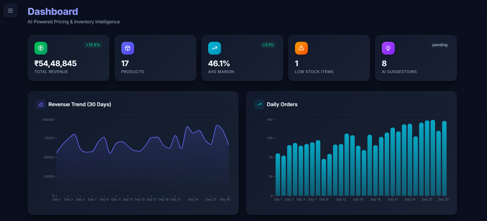
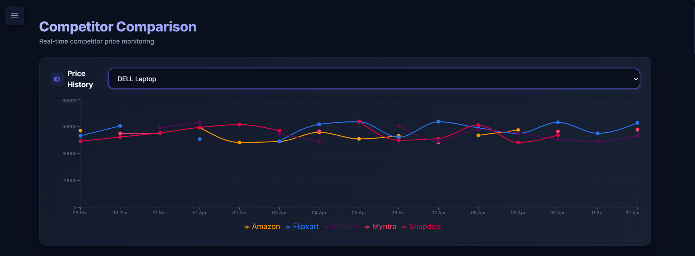
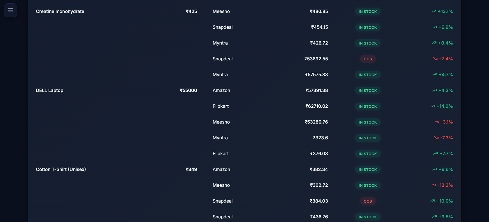
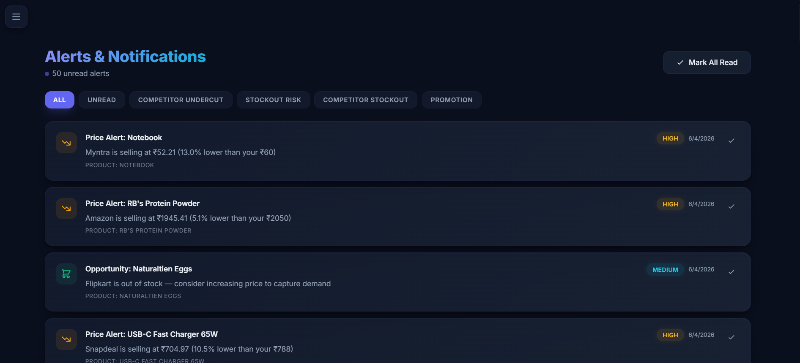

<p align="center">
  
</p>

<h1 align="center">🚀 PricePilot AI — Dynamic Pricing & Inventory Intelligence Platform</h1>

<p align="center">
  <strong>An AI-powered e-commerce pricing optimization platform that leverages machine learning, competitor analysis, and demand forecasting to deliver real-time pricing recommendations.</strong>
</p>

<p align="center">
  
  
  
  
  
  
</p>

---

## 📋 Project Information

| Field | Details |
|-------|---------|
| **Subject** | PSP (Project Survey and Practices) |
| **Project Title** | PricePilot AI — Dynamic Pricing & Inventory Intelligence Platform |
| **Academic Year** | 2025–2026 |

### 👥 Team Members

| Name | Roll No. |
|------|----------|
| **Rudra Babar** | B002 |
| **Aryan Desale** | B010 |
| **Shishir Bhavsar** | B030 |

---

## 📖 Table of Contents

- [About the Project](#-about-the-project)
- [Key Features](#-key-features)
- [Architecture](#-architecture)
- [Tech Stack](#-tech-stack)
- [Project Structure](#-project-structure)
- [Getting Started](#-getting-started)
- [Environment Variables](#-environment-variables)
- [Deployment](#-deployment)
- [Screenshots](#-screenshots)
- [Research Papers & Inspiration](#-research-papers--inspiration)
- [License](#-license)

---

## 🎯 About the Project

**PricePilot AI** is a full-stack AI-powered platform designed for e-commerce businesses to optimize their pricing strategies in real time. The platform integrates multiple data signals — competitor pricing, demand fluctuations, inventory levels, weather patterns, social sentiment, and search trends — to generate intelligent pricing recommendations that maximize revenue and maintain competitive positioning.

Traditional pricing strategies rely on static rules and manual adjustments, which fail to adapt to rapidly changing market dynamics. PricePilot AI addresses this gap by applying **machine learning**, **time-series forecasting (ARIMA/ETS)**, and **large language models (Google Gemini)** to deliver data-driven, explainable pricing decisions.

### Problem Statement

E-commerce businesses face several pricing challenges:
- **Manual pricing** cannot scale across thousands of SKUs
- **Competitor prices** change frequently and unpredictably
- **Demand patterns** are influenced by seasonality, events, weather, and social trends
- **Inventory management** requires proactive stock-out prevention
- **Revenue optimization** needs balancing margin targets with market competitiveness

PricePilot AI solves these challenges with automated, intelligent pricing that adapts in real time.

---

## ✨ Key Features

### 🤖 AI-Powered Pricing Engine
- **Binary Search Margin Optimization**: Dynamically finds the exact price point that mathematically maximizes total gross profit.
- **Dynamic Price Elasticity Estimation**: Adjusts theoretical volume shifts based on composite demand trend metrics.
- **LLM-Powered Explainability**: Google Gemini directly translates complex matrix math into plain-English "Insights" for merchants.
- Automated promotion suggestions based on stock ratios and weakened demand signals.

### 📊 Demand Forecasting
- **Facebook Prophet Integration**: Advanced Bayesian time-series model decomposing weekly/yearly seasonality and non-linear trend curves.
- **Graceful Fallbacks**: Automatically relies on Holt-Winters Exponential Smoothing or Moving Averages if data volume is inadequate.
- 30-day forward demand prediction with statistical confidence scores.
- Inventory reorder calculations derived directly from expected future depletion rates.

### 🏷️ Competitor Intelligence
- **Rainforest API Integration**: Real-time distributed web scraping for live Amazon marketplace ASIN telemetry.
- **Weighted Analysis**: Adjusts internal pricing gravity based on competitors' actual stock availability and review ratings.
- Automated price position analysis (cheapest, average, premium).

### 📈 Interactive Dashboard
- Real-time KPI cards with revenue, margins, and stock metrics
- 30-day revenue trend and order volume charts (Recharts)
- AI recommendation feed with accept/reject actions
- Alert system with severity-based prioritization (critical/high/medium/low)

### 🔐 Authentication & Security
- JWT-based authentication with secure token management
- Role-based access control (Admin / Manager / User)
- Password hashing with bcrypt
- Protected API routes with middleware guards

### 🎨 Premium UI/UX
- Dark-mode glassmorphism design system
- Smooth micro-animations and transitions
- Responsive layout with collapsible sidebar
- Gradient accent colors and floating orb backgrounds

---

## 🏗️ Architecture


The system follows a **microservices architecture** with three main components:
1. **React Client** — Single-page application with responsive UI
2. **Node.js API Server** — RESTful backend with MongoDB for data persistence
3. **Python AI Service** — FastAPI microservice for ML workloads (forecasting, optimization, LLM insights)

---

## 🛠️ Tech Stack

### Frontend
| Technology | Purpose |
|-----------|---------|
| React 19 | UI framework |
| Vite 7 | Build tool & dev server |
| Tailwind CSS 4 | Utility-first styling |
| Recharts | Data visualization (charts) |
| React Router 7 | Client-side routing |
| Axios | HTTP client |
| React Hot Toast | Toast notifications |
| React Icons | Icon library (Heroicons) |

### Backend
| Technology | Purpose |
|-----------|---------|
| Node.js 20 | Server runtime |
| Express 4 | Web framework |
| MongoDB + Mongoose 8 | Database & ODM |
| JWT (jsonwebtoken) | Authentication |
| bcryptjs | Password hashing |
| node-cron | Scheduled tasks |
| Puppeteer | Web scraping (competitor data) |

### AI Service
| Technology | Purpose |
|-----------|---------|
| Python 3.12 | Runtime |
| FastAPI | API framework |
| Facebook Prophet | Bayesian Time-Series Forecasting |
| Rainforest API | Distributed Web Scraping (Amazon) |
| Google Generative AI | LLM-powered insights (Gemini) |
| Pydantic / Pandas | Data validation & computation |

### DevOps
| Technology | Purpose |
|-----------|---------|
| Docker | Containerization |
| Docker Compose | Multi-container orchestration |

---

## 📁 Project Structure

```
ecom-ai-project/
├── client/                     # React Frontend (Vite)
│   ├── src/
│   │   ├── api/                # Axios API client
│   │   │   └── index.js        # All API endpoint functions
│   │   ├── components/         # Reusable UI components
│   │   │   ├── Layout.jsx      # App shell with sidebar toggle
│   │   │   └── Sidebar.jsx     # Navigation sidebar (collapsible)
│   │   ├── context/
│   │   │   └── AuthContext.jsx  # Authentication state management
│   │   ├── pages/              # Route-level page components
│   │   │   ├── Dashboard.jsx   # Main dashboard with KPIs & charts
│   │   │   ├── Products.jsx    # Product CRUD management
│   │   │   ├── Competitors.jsx # Competitor price tracking
│   │   │   ├── DemandSignals.jsx # Demand signal monitoring
│   │   │   ├── Forecasts.jsx   # AI demand forecasting
│   │   │   ├── Recommendations.jsx # AI pricing recommendations
│   │   │   ├── Alerts.jsx      # Alert management
│   │   │   ├── Login.jsx       # User login
│   │   │   └── Register.jsx    # User registration
│   │   ├── App.jsx             # Root component with routing
│   │   ├── index.css           # Global styles & design system
│   │   └── main.jsx            # React entry point
│   ├── index.html              # HTML template
│   ├── vite.config.js          # Vite configuration
│   └── package.json
│
├── server/                     # Node.js Backend (Express)
│   ├── config/
│   │   └── db.js               # MongoDB connection
│   ├── controllers/            # Route handlers (business logic)
│   │   ├── aiController.js     # AI recommendation & forecast logic
│   │   ├── alertController.js  # Alert CRUD
│   │   ├── authController.js   # Login, register, profile
│   │   ├── competitorController.js
│   │   ├── demandController.js
│   │   └── productController.js
│   ├── middleware/              # Express middleware
│   ├── models/                 # Mongoose schemas
│   │   ├── User.js
│   │   ├── Product.js
│   │   ├── CompetitorPrice.js
│   │   ├── DemandSignal.js
│   │   ├── PricingRecommendation.js
│   │   ├── InventoryForecast.js
│   │   └── Alert.js
│   ├── routes/                 # API route definitions
│   ├── cron/                   # Scheduled jobs (price checks, alerts)
│   ├── seed/                   # Database seeding scripts
│   ├── services/               # External service integrations
│   ├── server.js               # Express app entry point
│   └── package.json
│
├── ai-service/                 # Python AI Microservice (FastAPI)
│   ├── routes/
│   │   ├── forecast.py         # Demand forecasting endpoint
│   │   ├── optimize.py         # Price optimization endpoint
│   │   └── insights.py         # LLM insight generation
│   ├── services/
│   │   ├── forecasting.py      # ARIMA/ETS time-series models
│   │   ├── pricing.py          # Multi-factor pricing algorithm
│   │   └── llm_insights.py     # Google Gemini integration
│   ├── main.py                 # FastAPI app entry point
│   └── requirements.txt        # Python dependencies
│
├── docker-compose.yml          # Multi-container Docker setup
├── Dockerfile                  # Node server + React client build
├── Dockerfile.ai               # Python AI service
├── .env.example                # Environment variable template
├── .gitignore
└── README.md                   # This file
```

---

## 🚀 Getting Started

### Prerequisites

- **Node.js** ≥ 18.x ([Download](https://nodejs.org/))
- **Python** ≥ 3.9 ([Download](https://www.python.org/))
- **MongoDB** (local or [MongoDB Atlas](https://www.mongodb.com/atlas))
- **Google Gemini API Key** ([Get one](https://makersuite.google.com/app/apikey))

### 1. Clone the Repository

```bash
git clone https://github.com/your-username/pricepilot-ai.git
cd pricepilot-ai
```

### 2. Set Up Environment Variables

```bash
cp .env.example .env
```

Edit `.env` with your values:
```env
MONGODB_URI=mongodb+srv://<user>:<pass>@cluster0.xxxxx.mongodb.net/pricepilot
JWT_SECRET=your_strong_secret_key
AI_SERVICE_URL=http://localhost:8000
LLM_API_KEY=your_google_gemini_api_key
VITE_API_URL=http://localhost:5000/api
```

### 3. Install Dependencies

```bash
# Server
cd server && npm install

# Client
cd ../client && npm install

# AI Service
cd ../ai-service
pip install -r requirements.txt
```

### 4. Seed the Database (Optional)

```bash
cd server
npm run seed
```

### 5. Start All Services

Open three terminal windows:

```bash
# Terminal 1 — Backend API
cd server && npm run dev

# Terminal 2 — React Frontend
cd client && npm run dev

# Terminal 3 — AI Service
cd ai-service && uvicorn main:app --reload --port 8000
```

The app will be available at:
- **Client**: http://localhost:5173
- **API Server**: http://localhost:5000
- **AI Service**: http://localhost:8000 (Swagger docs at `/docs`)
- **Demo Login**: `admin@ecom.ai` / `admin123`

---

## 🔐 Environment Variables

| Variable | Description | Required |
|---------|-------------|----------|
| `MONGODB_URI` | MongoDB connection string | ✅ |
| `JWT_SECRET` | Secret key for JWT signing | ✅ |
| `PORT` | Server port (default: 5000) | ❌ |
| `AI_SERVICE_URL` | AI microservice URL | ✅ |
| `LLM_API_KEY` | Google Gemini API key | ✅ |
| `VITE_API_URL` | Client-side API base URL | ❌ |
| `NODE_ENV` | Environment (`development` / `production`) | ❌ |
| `CLIENT_URL` | Allowed CORS origin in production | ❌ |

---

## 🐳 Deployment

### Docker Compose (Recommended)

The easiest way to deploy the entire stack:

```bash
# Build and start all services
docker-compose up -d --build

# View logs
docker-compose logs -f

# Stop services
docker-compose down
```

This starts:
- **MongoDB** on port 27017
- **API Server** on port 5000 (with built React client)
- **AI Service** on port 8000

### Manual Production Build

```bash
# 1. Build the React client
cd client && npm run build

# 2. Start the server in production mode
cd ../server
NODE_ENV=production node server.js
```

The server will serve the built React app and the API from a single port (5000).

### Cloud Deployment Options

| Platform | Method |
|---------|--------|
| **Render** | Deploy Node server as Web Service, AI service as separate service |
| **Railway** | Monorepo deploy with Dockerfile |
| **Vercel** | Client on Vercel, Server on Railway/Render |
| **AWS EC2** | Docker Compose on EC2 instance |
| **Google Cloud Run** | Containerized deployment |

---

## 📸 Screenshots

> _Run the application locally to see the premium glassmorphism UI with dark mode, animated dashboard, and interactive charts._

### Pages Overview

**Dashboard** — KPI cards, revenue trends, order charts, AI recommendations feed


**Products** — CRUD table with inline editing and stock management


**Competitors** — Track competitor prices with automated scraping



**Demand Signals** — Composite demand scoring with trend visualization


**Forecasts** — 30-day demand predictions with confidence intervals


**AI Recommendations** — Accept/reject pricing suggestions with LLM explanations


**Alerts** — Severity-based alert inbox with mark-as-read functionality


---

## 📚 Research Papers & Inspiration

The following research papers and academic works inspired the design and methodology of PricePilot AI:

### Dynamic Pricing & Revenue Optimization

1. **"Dynamic Pricing in E-Commerce: A Survey"**
   - Authors: M. den Boer
   - Published: *European Journal of Operational Research*, 2015
   - DOI: [10.1016/j.ejor.2015.07.024](https://doi.org/10.1016/j.ejor.2015.07.024)
   - Key Contribution: Comprehensive survey of dynamic pricing models in online retail environments

2. **"Personalized Dynamic Pricing with Machine Learning"**
   - Authors: N. C. Pereira, et al.
   - Published: *arXiv*, 2023
   - Link: [https://arxiv.org/abs/2312.10738](https://arxiv.org/abs/2312.10738)
   - Key Contribution: ML-based personalized pricing strategies achieving 8-12% revenue uplift

3. **"Competitive Dynamic Pricing with Reinforcement Learning"**
   - Authors: A. Kastius, R. Schlosser
   - Published: *Journal of Revenue and Pricing Management*, 2022
   - DOI: [10.1057/s41272-021-00285-3](https://doi.org/10.1057/s41272-021-00285-3)
   - Key Contribution: Multi-agent RL models for competitive pricing in marketplace settings

### Demand Forecasting

4. **"Forecasting at Scale" (Facebook Prophet)**
   - Authors: S. J. Taylor, B. Letham
   - Published: *The American Statistician*, 2018
   - DOI: [10.1080/00031305.2017.1380080](https://doi.org/10.1080/00031305.2017.1380080)
   - Key Contribution: Decomposable time-series model handling seasonality and trend changes at scale

5. **"Deep Learning for Time Series Forecasting: A Survey"**
   - Authors: B. Lim, S. Zohren
   - Published: *Philosophical Transactions of the Royal Society A*, 2021
   - DOI: [10.1098/rsta.2020.0209](https://doi.org/10.1098/rsta.2020.0209)
   - Key Contribution: Overview of deep learning approaches for temporal data including LSTM, Transformer models

### AI & LLM in E-Commerce

6. **"Large Language Models for E-Commerce: A Survey"**
   - Authors: Y. Li, et al.
   - Published: *arXiv*, 2024
   - Link: [https://arxiv.org/abs/2312.11364](https://arxiv.org/abs/2312.11364)
   - Key Contribution: Survey of LLM applications in product descriptions, recommendations, and customer insights

7. **"Competitor Price Monitoring Using Web Scraping and Machine Learning"**
   - Authors: R. Gupta, S. Sharma
   - Published: *International Journal of Computer Applications*, 2020
   - Key Contribution: Automated competitor price tracking methodology for e-commerce platforms

### Inventory Optimization

8. **"Inventory Management with Machine Learning: A Review"**
   - Authors: E. Punia, S. Nikolopoulos, et al.
   - Published: *International Journal of Production Research*, 2020
   - DOI: [10.1080/00207543.2019.1693637](https://doi.org/10.1080/00207543.2019.1693637)
   - Key Contribution: ML-driven inventory policies outperforming traditional statistical methods

---

## 📄 License

This project is developed as part of the **PSP (Project Survey and Practices)** curriculum. For educational purposes only.

---

<p align="center">
  Developed by <strong>Rudra Babar</strong>, <strong>Aryan Desale</strong> & <strong>Shishir Bhavsar</strong>
</p>
